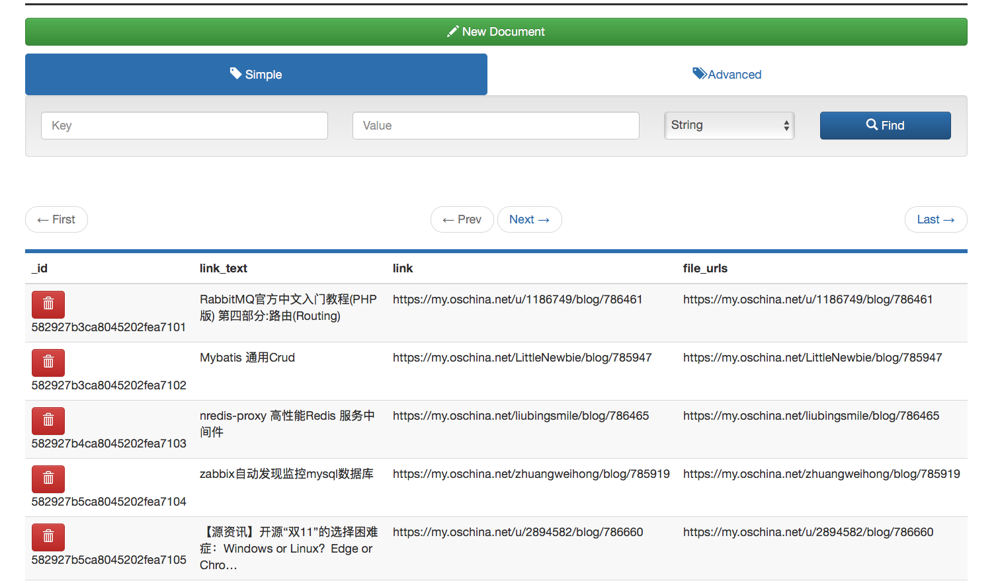

# 使用scrapy自动获取工作用的网页

因为工作原因，经常需要下载一些有用的素材，包括文章范文、图片、`pdf`文件等。

逐个下载太麻烦，一直想学习爬虫技术，用来提高效率，学习新的`python`知识。

经过多次反复和选择，觉得`scrapy`还是很不错的，当然对于确实有些复杂。

但功夫不怕有心人，通过不懈努力，还是运行成功了，而且学到了很多的东西。



## 生成项目

以 `oschina` 为例

```shell
scrapy startproject oschina
cd oschina
```

## 爬虫

#### 生成模板`spider`然后修改:

```shell
scrapy genspider oschina oschina.net   # scrapy genspider 爬虫名 要爬取的域名
```

#### 基本功能

* 每一个爬虫有一个方法`parse`，可以实现网页的抓取

* 使用`css`来选择网页元素

* 基本的方法是`element::attr(href)`和`element::text`，获取链接和文本

* 使用`extract`和`extract_first`，输出元素的内容

* 使用`scrapy.Request`可以发送网页请求

#### 编辑 `spiders/oschina.py`:

```python
import scrapy
class OschinaSpider(scrapy.Spider):
    name = "oschina"
    allowed_domains = ["oschina.net"]
    start_urls = (
        'https://www.oschina.net/blog',
    )

    def parse(self, response):
        """
            open the blog page
        """
        for post in response.css('.item'):
            blog_url = post.css('header.blog-title-box > a.blog-title-link::attr(href)').extract_first()
            yield scrapy.Request(response.urljoin(blog_url), callback=self.parse_blog)
        """
            check every page
        """
        for next_page in response.css('a.next'):
            next_page_url =  next_page.css('::attr(href)').extract_first()
            yield scrapy.Request(response.urljoin(next_page_url), callback=self.parse_blog)

    def parse_blog(self, response):
        item = OschinaItem()
        item['link'] = response.url
        item['file_urls'] = response.url

        texts = response.css('.blog-heading > .title::text').extract()
        title = ""
        for text in texts:
            title += text
        item['link_text'] = title.strip()

        yield item
```

## 项

编辑 items.py, 内容如下:

```python
class orinocoItem(scrapy.Item):
    link = scrapy.Field()
    link_text = scrapy.Field()
    file_urls = scrapy.Field()
```

## 管道

#### 最强大的功能之一，可以自动化网页下载内容等全部的流程

* 每个返回的`item`，必须要有一个`file_urls`和`file_path`的键值

* 将`item`传入管道，`FilesPipeline`和`ImagesPipeline`就可以自动处理并下载

#### 编辑 `settings.py`, 内容如下:

```python
ITEM_PIPELINES = {
   'scrapy.pipelines.files.FilesPipeline': 1,
   'scrapy.pipelines.images.ImagesPipeline': 2,
}
FILES_STORE = 'files'
IMAGES_STORE = 'images'
IMAGES_EXPIRES = 90
IMAGES_THUMBS = {
    'small': (50, 50),
    'big': (270, 270),
}
```

#### 编辑 `pipelines.py`, 内容如下:

```python
"""
	text文件导出器，基于CsvItemExporter
	需要复写一下方法：
	@from_crawler:调用信号，触发实例的方法
	@spider_opened:打开爬虫时，输出到cvs文件
	@spider_closed:关闭爬虫时，关闭文件
	@process_item:处理项目
"""
class TextExportPipeline(object):

	def __init__(self):
        # 存储spider和file键值对
		self.files = {}

	@classmethod
	def from_crawler(cls, crawler):
        """spider - connect - pipeline"""
		pipeline = cls()
		crawler.signals.connect(pipeline.spider_opened, signals.spider_opened)
		crawler.signals.connect(pipeline.spider_closed, signals.spider_closed)
		return pipeline

	def spider_opened(self, spider):
		file = open('files/full/%s.csv' % spider.name, 'w+b')
		self.files[spider] = file
        # 调用exporter，开始输出
		self.exporter = CsvItemExporter(file, 0)
		self.exporter.start_exporting()

	def spider_closed(self, spider):
        # 结束输出
		self.exporter.finish_exporting()
		file = self.files.pop(spider)
		file.close()

	def process_item(self, item, spider):
        # 逐个输出
		self.exporter.export_item(item)
		return item
```

#### 如果使用`mongo`数据库

```python
import pymongo
class MongoPipeline(object):

    def __init__(self, mongo_host, mongo_port, mongo_db):
        self.mongo_host = mongo_host
        self.mongo_port = mongo_port
        self.mongo_db = mongo_db

    @classmethod
    def from_crawler(cls, crawler):
		return cls(
				mongo_host=crawler.settings.get('MONGO_HOST'),
				mongo_port=crawler.settings.get('MONGO_PORT'),
				mongo_db=crawler.settings.get('MONGO_DB', 'oschinadb'),
				)
    def open_spider(self, spider):
        # 打来爬虫时候，连接mongo数据库
        # 生成客户端
        self.client = pymongo.MongoClient(self.mongo_host, self.mongo_port)
        # 连接数据库
        self.db = self.client[self.mongo_db]

    def close_spider(self, spider):
        self.client.close()

    def process_item(self, item, spider):
        # 实用类名作为集合名称
        collection_name = item.__class__.__name__
        # 用客户端插入项的字典
        self.db[collection_name].insert(dict(item))
        return item
```

## 中间件

## 运行:

```shell
scrapy crawl oschina    #运行爬虫
```

## 发布

* 使用`docker`部署`scrapyd`服务器

```yml
scrapyd:
  image: vimagick/scrapyd
  ports:
    - "6800:6800"
  restart: always

scrapy:
  image: vimagick/scrapyd
  command: bash
  volumes:
    - .:/code
  working_dir: /code
  restart: always

```

* 使用`scrapyd`运行我们的爬虫服务器

```shell
docker-compose up -d # 后台运行
scrapyd-deploy -all  # 部署爬虫
curl http://127.0.0.1:6800/schedule.json -d project=VeNews -d spider=oschina # 运行爬虫
```

## 其它

和`pyspider`比较，`scrapy`有强大的自定义功能